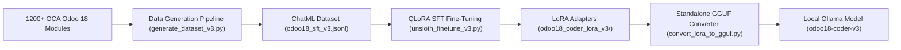
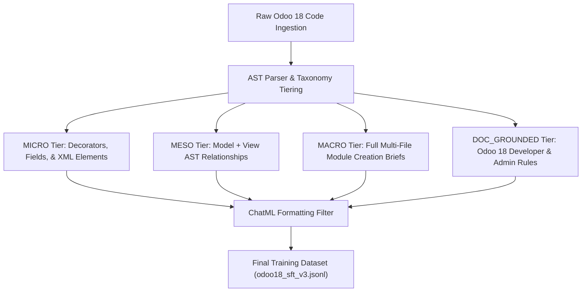
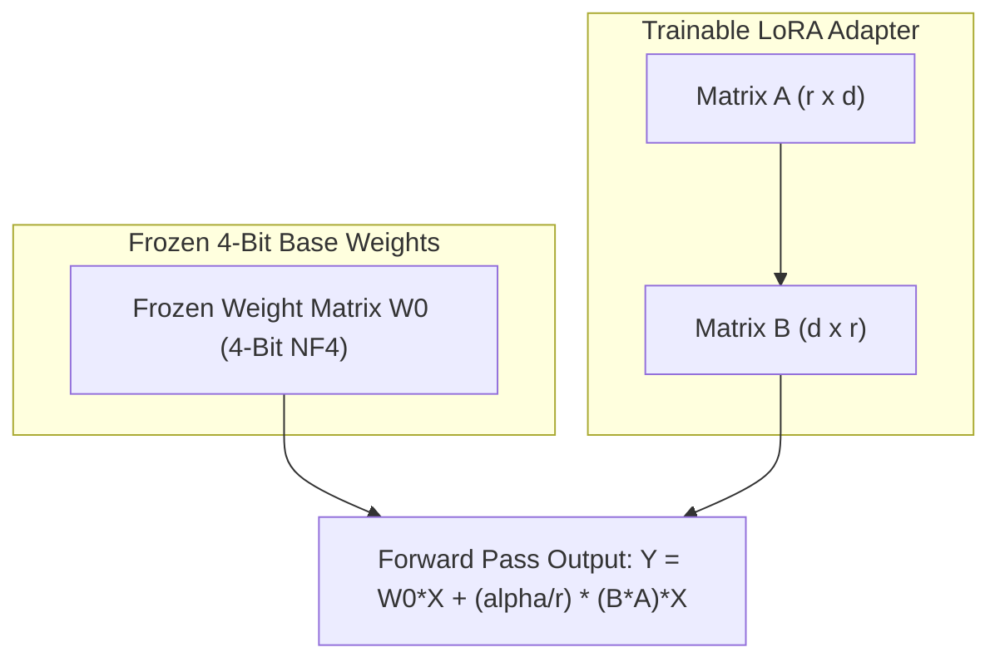
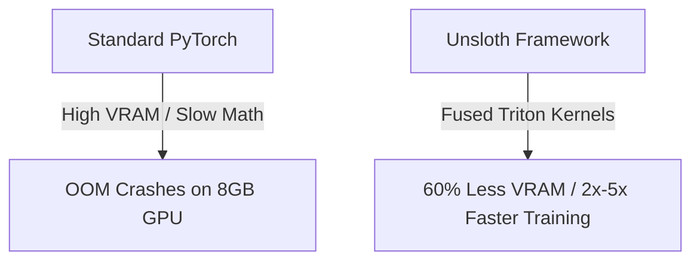
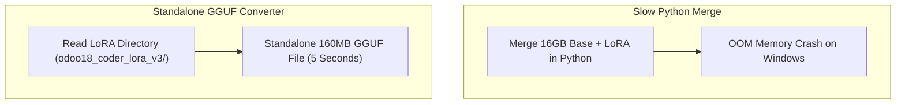

# 🧠 Odoo 18 AI Coder: Fine-Tuning & Dataset Generation Pipeline

> **A Complete Machine Learning Pipeline**: Learn how to build, fine-tune, and quantize a specialized **Odoo 18 Coding AI** on consumer hardware (8GB GPU) using QLoRA 4-bit SFT, Unsloth Fused Triton Kernels, and standalone GGUF conversion.

---

## 🎯 Overview & Architecture

This repository contains the end-to-end Machine Learning pipeline used to create `odoo18-coder-v3`:



---

## 📂 Repository Contents

| File / Folder | Description |
| :--- | :--- |
| **`generate_dataset_v3.py`** | 4-Tier ChatML SFT Dataset Generator script |
| **`odoo18_sft_v3.jsonl`** | The generated 67.3 MB SFT training dataset |
| **`unsloth_finetune_v3.py`** | Unsloth QLoRA 4-bit fine-tuning script for Qwen 2.5 Coder 7B |
| **`convert_lora_to_gguf.py`** | Standalone GGUF converter script for LoRA adapters |
| **`Modelfile`** | Ollama local model registration manifest |
| **`requirements.txt`** | PyTorch, Unsloth, and dataset pipeline dependencies |

---

## 🛠️ Step 1: Resource Curation (OCA Modules)

To train a high-precision Odoo 18 model, we collected **~1,200 Odoo Community Association (OCA) Odoo 18 modules** into a local resource directory (`./resource/`).

### 📌 How to Point the Script to Your Odoo Modules Folder
You can use any folder containing Odoo 18 modules or custom addons.

#### Method A: Command Line Argument
Pass the `--source-directory` argument when running the script:
```bash
python generate_dataset_v3.py --source-directory /path/to/your/odoo18/modules
```

#### Method B: Modify `generate_dataset_v3.py`
Inside `generate_dataset_v3.py` (Line 47), update the `source_directory` setting:
```python
class Settings(BaseSettings):
    # Change "./resource" to your custom Odoo 18 modules path:
    source_directory: Path = PydanticField(default=Path("/path/to/your/odoo18/modules"))
    output_dataset_file: Path = PydanticField(default=Path("./odoo18_sft_v3.jsonl"))
```

---

## 📊 Step 2: Data Generation Pipeline (`generate_dataset_v3.py`)

The dataset generator uses an AST parser and ChatML formatter to process raw Odoo 18 code across 4 structured taxonomy tiers:



### Run Data Generation:
```bash
python generate_dataset_v3.py
```

### Key Data Features:
* **Strict Odoo 18 Filtering**: Automatically strips out legacy Odoo 14/15 syntax (e.g. `@api.multi`, `<tree>` tags, `attrs="..."`, and `states="..."`).
* **ChatML Formatting**: Embeds strict `<|im_start|>` and `<|im_end|>` tokens to prevent infinite model generation loops.

---

## ⚡ Step 3: Supervised Fine-Tuning (SFT) with QLoRA & Unsloth

We fine-tuned `Qwen2.5-Coder-7B-Instruct` using **Unsloth** and **QLoRA (Quantized Low-Rank Adaptation)** on consumer hardware (8GB VRAM GPU).



Unsloth uses **Fused Triton Kernels** to reduce VRAM usage by **60%** and speed up training by 2x-5x:



### Run Fine-Tuning:
```bash
python unsloth_finetune_v3.py
```

### 📉 Final Training Loss: 0.5
Our model achieved a final **Cross-Entropy Loss of 0.5**.
* **Why 0.5 is optimal**: A loss of 0.5 is the "Goldilocks Zone" in language modeling—it proves the model absorbed complex Odoo 18 syntax and relational rules without overfitting (memorizing dataset lines).

---

## 🔄 Step 4: Standalone GGUF Quantization (`convert_lora_to_gguf.py`)

Instead of performing heavy, slow 16GB base-model merges in Python, we converted the learned LoRA adapter directory directly into a standalone **160 MB GGUF** binary file in 5 seconds:



### Run Conversion Script:
```bash
python convert_lora_to_gguf.py ./odoo18_coder_lora_v3
```
* Output file generated: `odoo18_coder_lora_v3.gguf` (160.5 MB)

---

## 🐳 Step 5: Register & Run Locally with Ollama

Register the standalone GGUF model with Ollama using the included `Modelfile`:

```dockerfile
FROM qwen2.5-coder:7b
ADAPTER ./odoo18_coder_lora_v3.gguf
TEMPLATE """<|im_start|>system ... <|im_end|>"""
```

### Create Ollama Model:
```bash
ollama create odoo18-coder-v3 -f Modelfile
```

### Test Local Inference:
```bash
ollama run odoo18-coder-v3 "Create a sale order inheritance model adding a custom job_no field"
```

---

## 💡 Why Train Locally?
1. **100% Data Privacy**: Private business logic and proprietary ERP modules never leave the local environment.
2. **Strict Version Locking**: Prevents the LLM from hallucinating deprecated Odoo tags from older framework versions.
3. **Zero API Costs**: Runs entirely on consumer GPUs with zero recurring cloud subscription fees.
