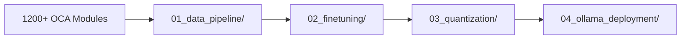
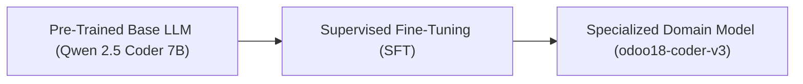
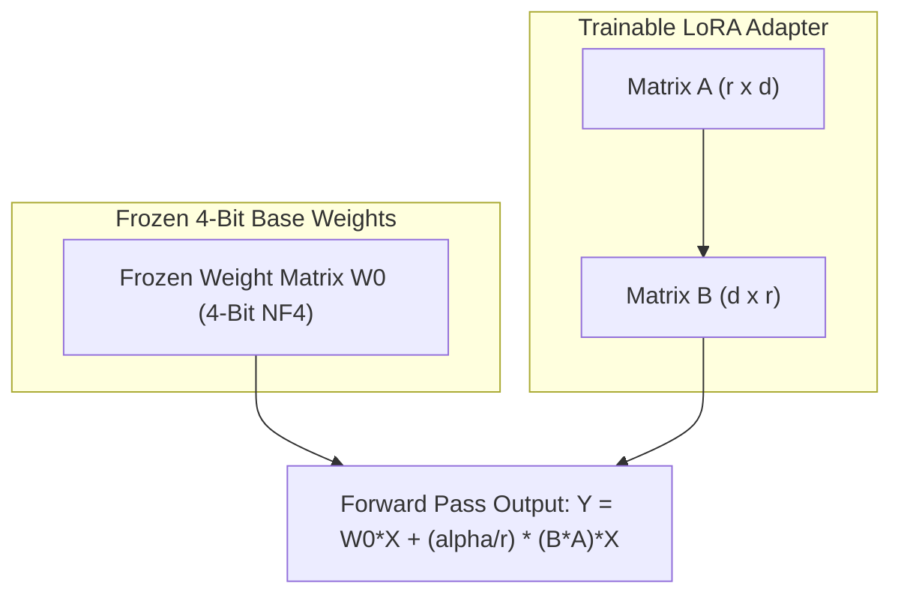
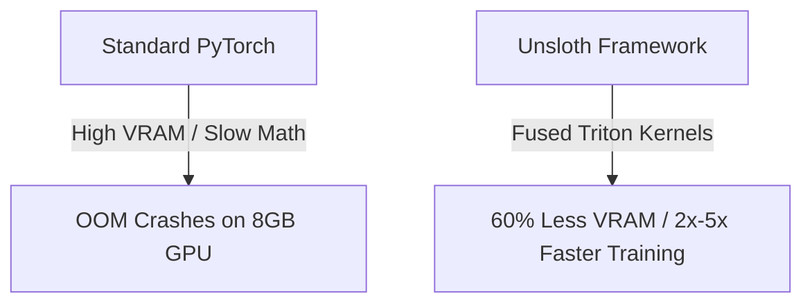

# 📘 Odoo 18 AI Coder: Fine-Tuning & Dataset Generation Handbook

> **A Modular Machine Learning Handbook & Guide**: An exploration into LLM Fine-Tuning, QLoRA mechanics, Unsloth Fused Triton Kernels, GGUF conversion, and dataset engineering to build a domain-expert Odoo 18 AI model on consumer hardware.

---

## 📂 Stage-Based Repository Architecture

This repository is organized into **4 sequential stage directories** covering the end-to-end Machine Learning lifecycle:

```text
Odoo18-AI-Coder/
├── 01_data_pipeline/             # 📊 Stage 1: Data Generation & Curation
│   ├── generate_dataset_v3.py    # 4-Tier ChatML AST Dataset Generator
│   └── odoo18_sft_v3.jsonl       # Generated 67.3 MB ChatML SFT Dataset
├── 02_finetuning/                # ⚡ Stage 2: QLoRA 4-Bit Fine-Tuning
│   ├── unsloth_finetune_v3.py    # Unsloth SFT Training Script (Qwen 2.5 Coder 7B)
│   └── odoo18_coder_lora_v3/     # Learned LoRA Adapters (safetensors via LFS)
├── 03_quantization/              # 🔄 Stage 3: Standalone GGUF Conversion
│   ├── convert_lora_to_gguf.py   # Standalone GGUF Converter Script
│   └── odoo18_coder_lora_v3.gguf # Standalone 160 MB GGUF Binary (via LFS)
├── 04_ollama_deployment/         # 🐳 Stage 4: Ollama Local Deployment
│   └── Modelfile                 # Ollama Local Model Registration Manifest
├── README.md                     # Narrative SFT Technical Handbook
├── DATA_GENERATION_AND_TRAINING.md # Detailed ML Handbook
├── requirements.txt              # PyTorch, Unsloth, & Pipeline Dependencies
├── .gitignore                    # Local storage exclusion rules
└── .gitattributes                # Git LFS Large File Tracking Rules
```

---

## 🧪 Important Context: An Experimental Learning Journey

Before diving into the fine-tuning details, it is important to contextualize this project. **Modern frontier models (like Claude 3.5 Sonnet, Claude 4.5 Opus, Gemini Pro, and GPT-4) are incredibly capable out-of-the-box and can handle almost any coding task thrown at them.** 

We are not claiming that our 7B local model is superior to these massive cloud APIs. Rather, this project is an **experimental demonstration and a learning exercise**. The true goal of this journey was to look "under the hood" of modern AI to understand:
* How fine-tuning actually works at a technical level.
* How to curate domain-specific datasets from raw open-source repositories.
* How parameter-efficient fine-tuning (QLoRA) makes consumer GPU training possible.
* How enterprises might leverage local, air-gapped models for 100% data privacy.

---

## 📌 Executive Summary of What We Did



1. **Curated a Dataset**: Extracted clean Odoo 18 code from ~1,200 OCA repositories into `01_data_pipeline/odoo18_sft_v3.jsonl` (67 MB).
2. **Fine-Tuned on an 8GB GPU**: Used QLoRA and Unsloth on `Qwen2.5-Coder-7B-Instruct` (`02_finetuning/`).
3. **Hit an Optimal Loss of 0.5**: Reached the ideal training balance between learning rules and maintaining generalization.
4. **Converted to Standalone GGUF**: Converted adapter weights into a 160 MB GGUF binary in 5 seconds (`03_quantization/odoo18_coder_lora_v3.gguf`).
5. **Deployed Locally via Ollama**: Registered `04_ollama_deployment/Modelfile` for 100% offline local inference (`odoo18-coder-v3`).

---

## 🧠 Part 1: High-Level Concepts (What is Fine-Tuning, QLoRA, & Unsloth?)

### 1.1 What is Fine-Tuning?
At a high level, **Fine-Tuning** is a form of transfer learning. We start with a "Base Model" (in our case, `Qwen2.5-Coder-7B`) that already understands Python and general software logic. Instead of training a model from scratch—which costs millions of dollars—we "fine-tune" its existing neural pathways using a specialized dataset so it becomes an expert in one specific domain (Odoo 18).



---

### 1.2 Fine-Tuning Techniques: Why We Chose QLoRA

There are a few ways to fine-tune a model:
* **Full Fine-Tuning (FFT)**: We update 100% of the model's billions of parameters. This yields great results but requires massive server clusters with over 56GB of VRAM.
* **Parameter-Efficient Fine-Tuning (PEFT)**: Instead of updating everything, we freeze the base model weights and only train a tiny percentage of new adapter parameters.

**We chose QLoRA (Quantized Low-Rank Adaptation).** Here is why it is the gold standard for consumer hardware:



1. **Freezing & Quantizing (The 'Q' in QLoRA)**: We take the base model and mathematically compress its weights down to 4-bit numbers (NormalFloat4). This drastically shrinks VRAM usage, allowing a 7B model to run inside an 8GB graphics card.
2. **The Adapter (The 'LoRA')**: We add a tiny, trainable "adapter" network on top of the frozen brain. 
3. **The Math**: LoRA decomposes massive neural weight updates ($\Delta W$) into two tiny matrices ($A$ and $B$). The math looks like this:
   $$\Delta W = \frac{\alpha}{r} (B \cdot A)$$

By only updating matrices $A$ and $B$, we get the quality of full fine-tuning while training less than 1% of total parameters!

---

### 1.3 Why Unsloth? (Fused Triton Kernels)

Training AI models in standard PyTorch is slow and heavy on VRAM. We used an open-source framework called **Unsloth** to accelerate training.



* **How it works**: Unsloth rewrites standard PyTorch matrix multiplication using custom OpenAI Triton Kernels. 
* **The Result**: It slashes VRAM usage by **60%** and speeds up fine-tuning by **2x to 5x** with zero loss in precision, enabling deep SFT training directly on consumer GPUs!

---

## 📉 Part 2: Understanding Results (We Hit a Loss of 0.5!)

During training, our final **Loss was 0.5**. What does this score mean?

### 2.1 What is "Loss"?
In machine learning, **Loss is the model's error score** (calculated using Cross-Entropy). 
Think of training as a fill-in-the-blank test:
* If the AI guesses the wrong word, its loss goes up.
* If it predicts the correct token (e.g. predicting `fields.` should be followed by `Char(string="...")`), its loss goes down.

* **High Loss (2.0 - 5.0)**: The AI is confused and guessing randomly.
* **Zero Loss (0.0)**: The AI has memorized the dataset line-by-line. This is **bad** (*overfitting*). An overfitted AI acts like a parrot—it can repeat exact lines of code it saw during training, but breaks when asked to solve new tasks.

### 2.2 Why a Loss of 0.5 is the "Goldilocks Zone"
In language modeling, a final loss around **0.5 to 0.8 is the ideal target**:
* **Learned Rules, Not Just Text**: A loss of 0.5 means the AI absorbed the underlying structural rules and syntax of Odoo 18 without blindly memorizing strings.
* **High Confidence**: The AI predicts valid Odoo 18 field types, decorators, and XML tags with mathematical confidence while retaining full creative problem-solving ability.

---

## 🛠️ Part 3: Step-by-Step Pipeline Walkthrough

### Stage 1: Data Generation & Curation (`01_data_pipeline/`)
We collected **~1,200 Odoo Community Association (OCA) Odoo 18 modules** as source material in `./resource/`.

#### 📌 How to Point `generate_dataset_v3.py` to Your Custom Odoo Code:

##### Method A: CLI Flag
```bash
python 01_data_pipeline/generate_dataset_v3.py --source-directory /path/to/your/odoo18/modules
```

##### Method B: Script Configuration
Inside `01_data_pipeline/generate_dataset_v3.py` (Line 47), edit `source_directory`:
```python
class Settings(BaseSettings):
    source_directory: Path = PydanticField(default=Path("./resource"))
```

#### Run Data Generation:
```bash
python 01_data_pipeline/generate_dataset_v3.py
```
* Output file generated: `01_data_pipeline/odoo18_sft_v3.jsonl` (67.3 MB)

---

### Stage 2: QLoRA Fine-Tuning (`02_finetuning/`)

Runs Supervised Fine-Tuning on `Qwen2.5-Coder-7B-Instruct` using Unsloth.

```bash
python 02_finetuning/unsloth_finetune_v3.py
```
* Outputs LoRA adapter weights: `02_finetuning/odoo18_coder_lora_v3/` (`adapter_model.safetensors`).

---

### Stage 3: Standalone GGUF Conversion (`03_quantization/`)

Converts the LoRA adapter directory into a standalone **160 MB GGUF** binary file in 5 seconds:

```bash
python 03_quantization/convert_lora_to_gguf.py 02_finetuning/odoo18_coder_lora_v3
```
* Output file generated: `03_quantization/odoo18_coder_lora_v3.gguf` (160.5 MB)

---

### Stage 4: Ollama Local Deployment (`04_ollama_deployment/`)

Registers the GGUF model binary with Ollama for local inference:

```bash
# Register with Ollama
ollama create odoo18-coder-v3 -f 04_ollama_deployment/Modelfile

# Test local inference
ollama run odoo18-coder-v3 "Create a sale order inheritance model adding a custom job_no field"
```

---

## 💼 Why Train Locally?
1. **100% Air-Gapped Privacy**: Proprietary business logic never leaves your local infrastructure.
2. **Version Locking**: Locks the model to Odoo 18 syntax rules, eliminating hallucinations from legacy framework versions.
3. **Zero Recurring API Costs**: Runs indefinitely on local hardware with zero subscription fees.
